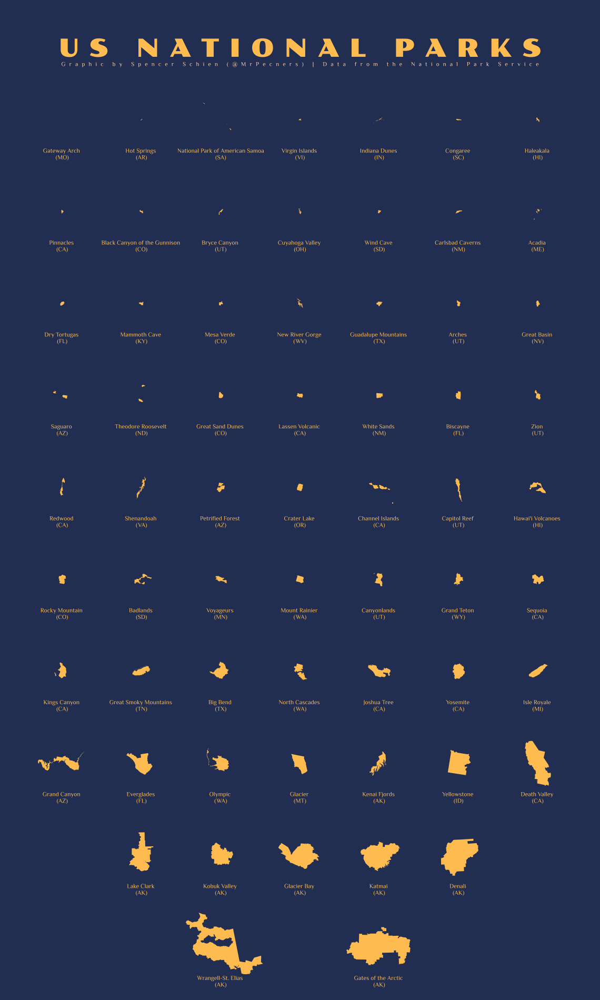

# About

This repo contains my contributions to [30DayMapChallenge2023](https://30daymapchallenge.com/).

# Contributions

## [Day 6 -Asia](R/day_6_asia)

## [Day 4 - A Bad Map](R/day_4_bad_map)

## [Day 3 - Polygons](R/day_3_polygons)

# [Day 2 - Lines](R/day_2_lines)

https://github.com/Pecners/30DayMapChallenge/assets/47727946/6079b881-9655-4b0e-80ca-07079fc2a6ae

# [Day 1 - Points](R/day_1_points)

https://github.com/Pecners/30DayMapChallenge/assets/47727946/8719c070-7984-4a36-ba9c-554ae25dd3ab

