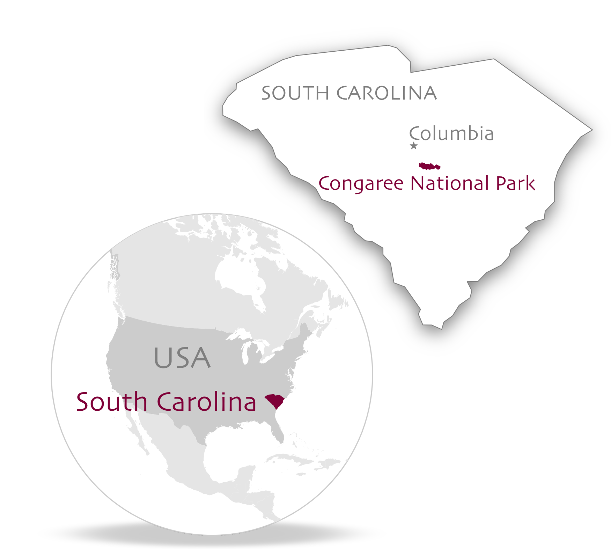
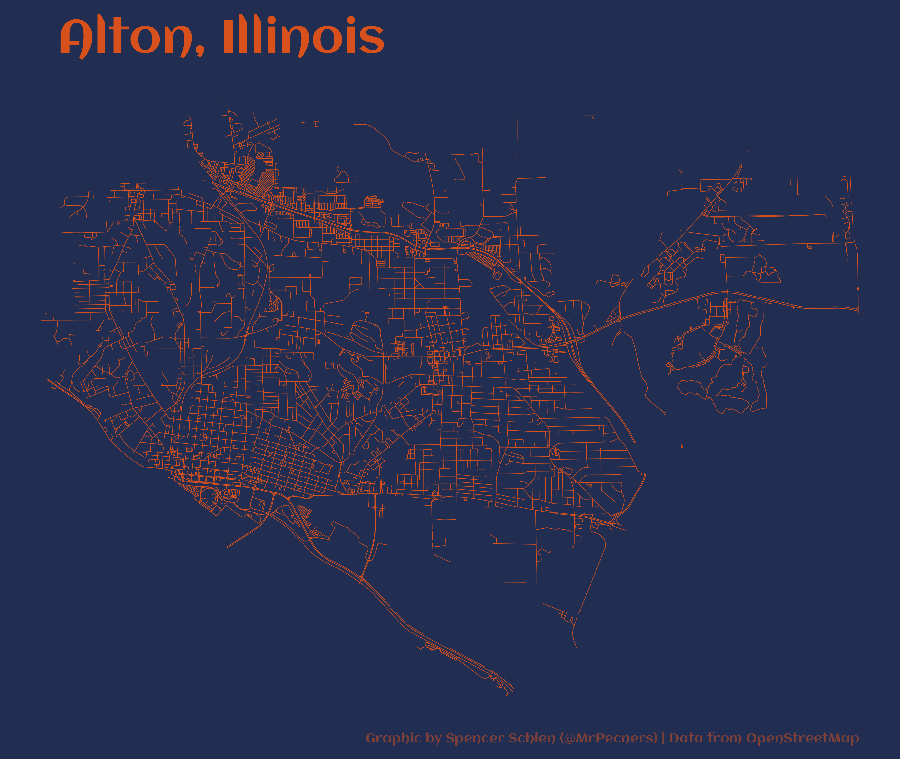
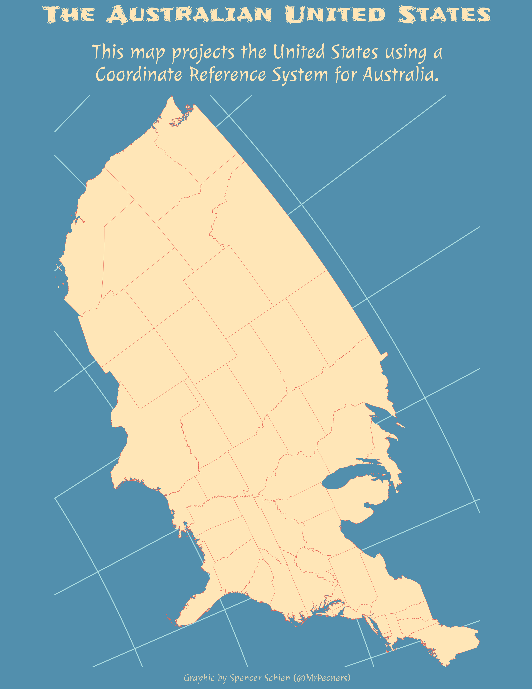
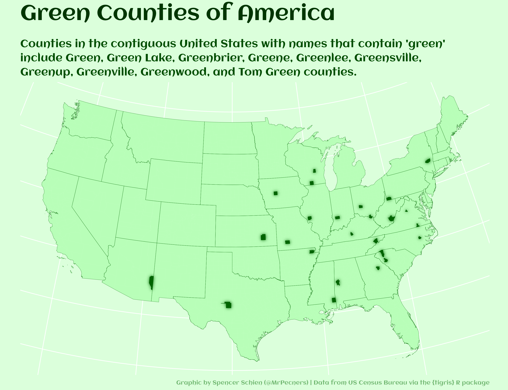
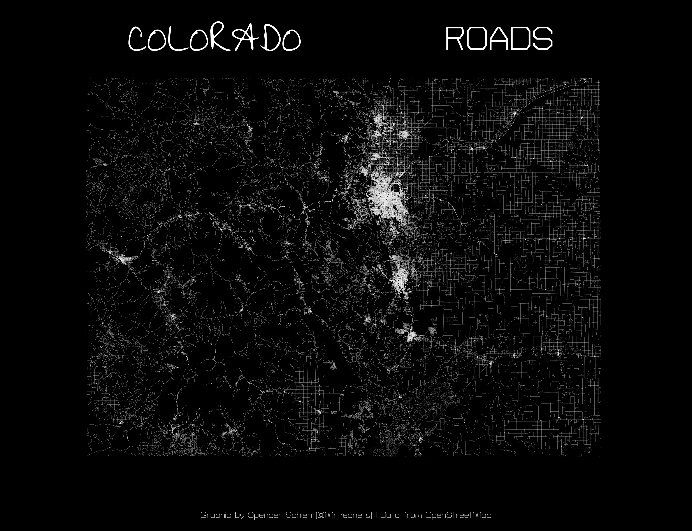

# About

This repo contains my contributions to [30DayMapChallenge2022](https://30daymapchallenge.com/).

# Contributions

## [Day 21—Kontur Population Data](R/day_21_kontur)

## [Day 20—My favorite...](https://github.com/Pecners/rayshader_portraits/tree/main/R/portraits/mount_katmai)

## [Day 19—Globe](R/day_19_globe)

## [Day 14—Hexagon (2nd Submission)](R/day_14_hexagon)

https://user-images.githubusercontent.com/47727946/202067052-4f931fa5-dcd1-4b40-9054-a99f30f60778.mp4

## [Day 14—Hexagon](R/day_14_hexagon)

https://user-images.githubusercontent.com/47727946/201817530-48bc8b81-1090-4833-9ac4-f8fb3ffb8d1a.mp4

## [Day 13—5 Minute Map](R/day_13_5_minute_map)

## [Day 11—Color Friday: Red](R/day_11_red)

## [Day 10—A bad map](R/day_10_bad_map)

## [Day 9—Space](R/day_9_space)

## [Day 7—Raster](R/day_7_raster)

## [Day 4—Green](R/day_4_green)

## [Day 3—Polygons](R/day_3_polygons)

## [Day 2—Lines](R/day_2_lines)

## [Day 1—Points](R/day_1_points)

https://user-images.githubusercontent.com/47727946/199230329-be5dac75-c4cf-43a5-9a1a-7dcd6ed46bd1.mp4

